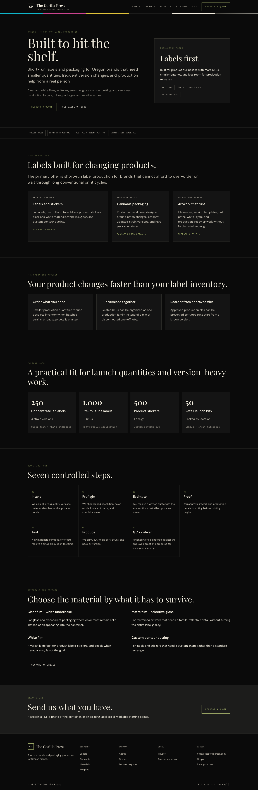

# The Gorilla Press Website

[](https://gorilla-press-website.vercel.app)

## 🚀 Live Demo

**[View the production website](https://gorilla-press-website.vercel.app)**

A responsive React/Vite website for The Gorilla Press, focused on short-run labels and packaging production for Oregon brands.

## Quick setup

```bash
npm install
npm run dev
```

Create `.env.local` from `.env.example` and provide a real quote-form endpoint before enabling submissions.

## Architecture overview

- React renders the interface and reusable page sections.
- React Router provides client-side routes for services, materials, file preparation, company information, quote intake, and legal pages.
- Vite provides local development and the production static build.
- Vercel serves the build and rewrites client-side routes to `index.html`.

See [ARCHITECTURE.md](ARCHITECTURE.md) for the full technical map and [TESTING.md](TESTING.md) for release checks.

## Current scope

The website intentionally avoids invented equipment claims, product specifications, and testimonials. The quote form reports a clear configuration error until `VITE_FORM_ENDPOINT` is connected to a real submission service.

## Recent updates

- **v1.2.0 — 2026-07-28:** Added production deployment configuration, crawler/share metadata, repository documentation, and current UI screenshots.

See [CHANGELOG.md](CHANGELOG.md) for the complete release history.
